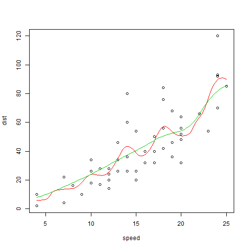

## The Nadaraya Watson kernel estimator

Nadaraya 1964 and Watson 1964 proposed to estimate m as a locally weighted average, using a kernel as a weighting function. The Nadaraya-Watson estimator is:

$$ \widehat{m}_h(x)=\frac{\sum_{i=1}^n K_h(x-x_i) y_i}{\sum_{i=1}^nK_h(x-x_i)} $$

where $K$ is a kernel with a bandwidth $h$. The fraction is a weighting term with sum 1.

--- 

## Smoothing paramter

$h$ is called the smoothing parameter because it controls the flexibility of the regression function. Large values of $h$ produce the smoothest functions that wiggle the least in response to fluctuations in the data. The smaller $h$ is, the closer the regression function will conform to the data.


---  


## R code

This app is going to show you how $h$ influence the relationship between `speed` and `dist` for `cars` data.


```r
require(graphics)
with(cars, {
    plot(speed, dist)
    lines(ksmooth(speed, dist, "normal", bandwidth = 2), col = 2)
    lines(ksmooth(speed, dist, "normal", bandwidth = 5), col = 3)
})
```


---

## Plot

 


